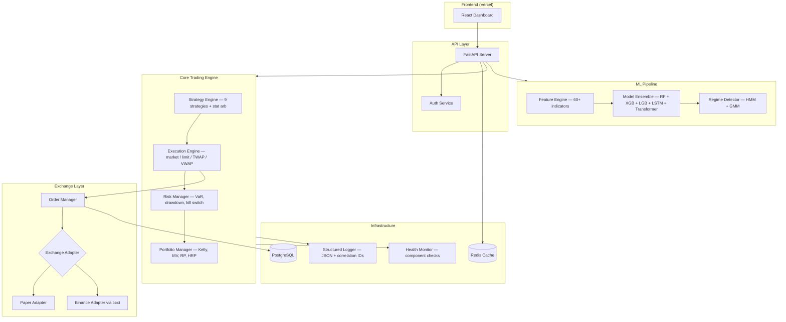

# Vision AI — System Architecture

## Overview

Vision AI is an institutional-grade algorithmic trading platform built for crypto markets. The system combines advanced ML models, quantitative signal engines, and robust execution infrastructure into a modular, production-ready platform.

---

## Architecture Diagram



---

## Module Map

| Module | Path | Responsibility |
|---|---|---|
| Core | `backend/src/core/` | Config, structured logging, health monitoring |
| Data | `backend/src/data/` | Market data ingestion, caching, normalization |
| Features | `backend/src/features/` | 60+ technical indicators and feature selection |
| Models | `backend/src/models/` | ML training, ensemble, regime detection, model registry |
| Research | `backend/src/research/` | Backtesting, alpha research, walk-forward validation |
| Strategy | `backend/src/strategy/` | 10 signal strategies including stat arb |
| Execution | `backend/src/execution/` | Order execution, order management, live safety |
| Risk | `backend/src/risk/` | Risk scoring, limits, VaR, kill switch |
| Portfolio | `backend/src/portfolio/` | Position tracking, optimization (Kelly, MV, RP, HRP) |
| Exchange | `backend/src/exchange/` | Abstract adapter — paper and Binance implementations |
| Sentiment | `backend/src/sentiment/` | FinBERT NLP, multi-source news aggregation |
| API | `backend/src/api/` | FastAPI REST endpoints (28+ routes) |
| Workers | `backend/src/workers/` | Background trading loop |
| Database | `backend/src/database/` | PostgreSQL persistence layer |
| Auth | `backend/src/auth/` | JWT authentication service |

---

## Deployment

| Component | Platform | Config |
|---|---|---|
| Frontend | Vercel | `frontend/ai-trading-dashboard/` |
| Backend API | Render / Docker | `deployment/Dockerfile` |
| Database | PostgreSQL 15 | `deployment/docker-compose.yml` |
| Cache | Redis 7 | `deployment/docker-compose.yml` |

### Quick Start

```bash
# Development
python -m backend.src.api.main

# Docker
cd deployment && docker-compose up --build

# Tests
python -m pytest tests/ -v
```

---

## API Endpoints (28+)

| Endpoint | Method | Description |
|---|---|---|
| `/health` | GET | System health |
| `/health/detailed` | GET | Component-level health |
| `/data/fetch` | POST | Fetch market data |
| `/features/generate` | POST | Generate features |
| `/model/train` | POST | Train ML models |
| `/model/predict` | POST | AI prediction + quant signals |
| `/model/registry` | GET | Model version history |
| `/backtest/run` | POST | Run backtest |
| `/portfolio/status` | GET | Portfolio state |
| `/portfolio/performance` | GET | Performance metrics |
| `/regime/current` | GET | Market regime |
| `/sentiment/current` | GET | News sentiment |
| `/risk/status` | GET | Risk dashboard |
| `/strategies/list` | GET | Available strategies |
| `/paper-trading/start` | POST | Start paper trading |
| `/paper-trading/stop` | POST | Stop paper trading |
| `/paper-trading/status` | GET | Paper trading metrics |
| `/live-trading/preflight` | GET | Safety pre-flight checks |
| `/live-trading/enable` | POST | Enable live trading |
| `/orders/active` | GET | Active orders |
| `/orders/history` | GET | Order history |
| `/news` | GET | Aggregated news |
| `/market-intelligence` | GET | Trending tokens |
| `/research/feature-importance` | GET | Feature importance |
