# Vision AI — System Architecture

## Overview

Vision AI is an institutional-grade AI quantitative trading platform built for real-time crypto market analysis, signal generation, and automated execution.

## Architecture Diagram

```mermaid
graph TD
    subgraph "Frontend (Vercel)"
        LP[Landing Page]
        LG[Login/Auth]
        DB[Dashboard Terminal]
        API_PROXY["Next.js API Proxy (/api/[...path])"]
    end

    subgraph "Backend (Render/K8s)"
        FASTAPI[FastAPI Server]
        
        subgraph "Core Services"
            DF[DataFetcher]
            FE[FeatureEngineer]
            MT[ModelTrainer]
            PR[Predictor]
            MR[ModelRegistry]
        end

        subgraph "Alpha Engine"
            QSE[QuantSignalEngine]
            MAE[MetaAlphaEngine]
            RD[RegimeDetector]
            DD[DriftDetector]
            SS[StrategySelector]
            SE[StrategyEngine]
        end

        subgraph "Execution"
            EE[ExecutionEngine]
            OM[OrderManager]
            CB[CircuitBreaker]
            SM[SlippageModel]
            TL[TradingLoop]
        end

        subgraph "Risk & Safety"
            RM[RiskManager]
            CE[ConfidenceEngine]
            RS[RiskScore]
            EC[ExposureController]
            CP[CrashProtection]
            LG2[LiveGuard]
            LS[LiveTradingSafety]
        end

        subgraph "Portfolio"
            PM[PortfolioManager]
        end

        subgraph "Security"
            AUTH[AuthService]
            GOV[Governance / Dual Approval]
            CSRF[CSRF Middleware]
            RL[Rate Limiter]
            SH[Security Headers]
        end

        subgraph "Observability"
            HM[HealthMonitor]
            MS[MonitoringService]
            ME[MetricsExporter]
            EMC[ExecutionMetricsCollector]
            SL[StructuredLogger]
        end
    end

    subgraph "Exchange"
        PA[PaperAdapter]
        BA[BinanceAdapter]
    end

    subgraph "Data Sources"
        BN[Binance REST/WS]
        NEWS[News APIs]
        RC[Redis Cache]
        PG[PostgreSQL]
    end

    DB --> API_PROXY
    DB -->|WebSocket| FASTAPI
    API_PROXY -->|HTTP| FASTAPI

    FASTAPI --> DF
    FASTAPI --> QSE
    FASTAPI --> EE
    FASTAPI --> PM
    FASTAPI --> RM
    FASTAPI --> AUTH

    DF --> BN
    EE --> PA
    EE --> BA
    PA --> PM
    BA --> BN

    FASTAPI --> RC
    AUTH --> PG
    GOV --> PG
    HM --> ME
```

## Component Interaction

### Data Flow
1. **Market Data**: Binance → DataFetcher → FeatureEngineer → ML Models → Signals
2. **Execution**: Signal → Risk Check → Order Manager → Exchange Adapter → Fill → Portfolio
3. **WebSocket**: Backend → 4 Channels (market, signals, portfolio, metrics) → Frontend Terminal

### Request Flow
1. Browser → Next.js API Proxy → FastAPI Backend
2. Auth cookies injected at proxy layer via `vision_ai_token` cookie
3. CSRF tokens validated on mutating requests
4. Rate limiting enforced at middleware level

## Security Posture

| Control | Implementation |
|---------|---------------|
| Authentication | JWT via HttpOnly cookies |
| CSRF | Double-submit token (cookie + header) |
| Rate Limiting | Per-IP sliding window (60 req/60s) |
| Security Headers | HSTS, CSP, X-Frame-Options, X-XSS-Protection |
| Account Lockout | 5 failures → 15min lockout |
| MFA | Optional TOTP step-up for critical actions |
| Dual Approval | Required for live trading enablement |
| Input Validation | Pydantic models with field constraints |
| Audit Logging | All security-critical actions logged to DB |
| Kill Switch | Emergency halt for all trading |
| Circuit Breaker | Auto-trip on consecutive execution failures |

## Deployment

### Vercel (Frontend)
- Next.js 16 with App Router
- API proxy catch-all route handles backend communication
- WebSocket connections direct to backend

### Render (Backend)
- FastAPI with uvicorn
- Lifespan-based service initialization (deferred startup)
- Health endpoint for liveness probes

### Kubernetes (Production)
- Namespace-isolated deployment
- HPA (2-8 replicas) based on CPU/memory
- PDB (minAvailable: 1) for zero-downtime deployments
- Network policies restricting inter-pod communication
- Separate worker deployment for trading loops
- Ingress with TLS termination

## Technology Stack

| Layer | Technology |
|-------|-----------|
| Frontend | Next.js 16, React 19, TypeScript, Tailwind CSS 4, Zustand, Framer Motion |
| Backend | Python, FastAPI, Pydantic v2, uvicorn |
| ML | LightGBM, scikit-learn, NumPy, pandas |
| Charting | lightweight-charts v4 |
| State | Zustand (client), Redis (server) |
| Database | PostgreSQL (production), SQLite (development) |
| Exchange | Binance REST + WebSocket API |
| Deployment | Vercel, Render, Docker, Kubernetes |
