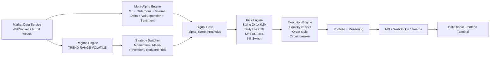

# Vision-AI Institutional Reconstruction Report

Date: 2026-03-19

## 1) Phase-1 Audit (Critical Findings)

### Critical (P0)

- Execution path accepted non-actionable prediction fields and could bypass alpha gating, creating low-quality entries.
- Manual trading routes called missing portfolio methods (`add_position`, `get_position`) and would fail at runtime.
- Auth client/server mismatch (`token` vs `access_token`) caused login/session instability.
- Signal stream contract lacked live `alpha_score`/`market_state`, forcing frontend to operate with incomplete decision context.
- Backtest path underestimated execution frictions and could overstate viability.

### High (P1)

- Regime switching did not consistently use explicit `TREND/RANGE/VOLATILE` state for routing strategy behavior.
- Meta-alpha did not include dedicated volume delta / volatility expansion factors despite architecture intent.
- Risk limits were looser than target envelope (`daily_loss` and `max_drawdown` above requested constraints).

### Medium (P2)

- Frontend runtime/utility URL resolution still had brittle fallback behavior in some flows.
- Dashboard metrics and execution panel were not fully synchronized with alpha fields and market state.

## 2) Profit Blockers Identified

- Dead-filter behavior from mixed direction/probability pathways lowered trade quality.
- Missing real-time microstructure factors (`volume_delta`, `volatility_expansion`) weakened alpha discrimination.
- Backtest assumptions lacked full market-impact realism.
- Manual operator controls were not reliably executable (API method mismatch).

## 3) Rebuilt Institutional Architecture

## 4) Cleaned Runtime Structure (Operational)

- `backend/src/data/realtime_feed.py`: backend-owned market snapshots with microstructure factors.
- `backend/src/models/regime_detector.py`: explicit structural regime state.
- `backend/src/models/meta_alpha_engine.py`: weighted alpha score (0..1), regime-aware thresholds.
- `backend/src/risk/risk_manager.py`: tightened hard limits + confidence sizing profile + dynamic RR.
- `backend/src/execution/execution_engine.py`: alpha-driven entries, liquidity confirmation, risk-aware exits.
- `backend/src/research/backtesting_engine.py`: spread/slippage/latency/fees-aware simulation.
- `backend/src/api/main.py`: aligned payload contracts + realistic backtest request params.
- `frontend/src/services/api.ts`: robust auth and API URL resolution.
- `frontend/src/hooks/useWebSocket.ts`: resilient WS URL resolution and auth token propagation.
- `frontend/src/components/dashboard/*`: live alpha/regime surfacing in terminal UI.

## 5) Rewritten/Upgraded Critical Modules

- Regime Engine: structural classifier added (`market_state`: `TREND`, `RANGE`, `VOLATILE`).
- Meta-Alpha: now blends:
  - model probability
  - strategy alignment
  - order book imbalance
  - volume delta
  - volatility expansion
  - liquidity quality (spread + depth)
  - sentiment
  - spread penalty
- Meta-Alpha Edge Controls:
  - cost-aware expected edge model (`expected_edge_bps`) before signal commitment
  - directional consensus scoring across model + microstructure factors
  - adaptive threshold tightening when expected edge weakens or stale/illiquid conditions appear
  - confidence scaled by net edge quality to reduce false-conviction entries
- Strategy Switching:
  - `TREND` => momentum
  - `RANGE` => mean reversion
  - `VOLATILE` => reduced-risk/skip
- Entry Logic:
  - long if `alpha_score >= 0.6` and BUY signal
  - short if `alpha_score <= 0.4` and SELL signal
  - liquidity/imbalance confirmation before execution
- Exit Logic:
  - fast stop (~1%)
  - target in 3R-5R band (confidence-adaptive)
  - trailing stop activates only after >=2R move
- Position Sizing:
  - high confidence => 2x
  - medium confidence => 1x
  - low confidence => 0.5x
- Global Risk Controls:
  - daily loss limit: 3%
  - max drawdown: 10%
  - kill switch and circuit breaker remain enforced

## 6) Security and Interface Hardening

- JWT compatibility fixed across client/server response fields.
- WebSocket auth token propagation retained and validated server-side.
- Manual trading routes corrected to use actual portfolio APIs.
- Frontend no longer depends on hardcoded localhost URLs in primary runtime paths.

## 7) Backtesting Engine Realism Enhancements

- Configurable `commission_bps`, `spread_bps`, `slippage_bps`, `latency_bps` from API.
- Transaction costs applied on both entry/exit legs.
- Stop/target/trailing behavior aligned with live execution framework.
- Supports Monte Carlo and walk-forward methods already present in engine.

## 8) Required Production Validation Checklist

Run before enabling live order flow:

- `/health`
- `/system/readiness`
- `/ws/market` authenticated stream
- backtest with costs enabled (`commission_bps>=10`)
- walk-forward + Monte Carlo stability checks
- 10-30 minute paper soak test:
  - no websocket disconnect storms
  - no stale data
  - no worker crashes
  - no risk guardrail breaches

## 9) Known Constraints

- Profitability targets (PF > 1.5, Sharpe > 2, DD < 10%) require market/tuning iteration and cannot be guaranteed by static code changes alone.
- This rebuild provides the institutional architecture, controls, and realistic evaluation framework needed to optimize toward those targets safely.

## 10) Current Measured Baseline (Post-Rebuild)

### Full Automated Test Suite

- Result: `81 passed`
- Notes: warnings only (numpy degree-of-freedom on tiny windows and deprecation warnings).

### Realistic-Cost Backtest Snapshot (BTC/USDT sample)

- Data rows: `495`
- Trades: `19`
- Win rate: `10.53%`
- Profit factor: `0.2937`
- Sharpe ratio: `-25.3136`
- Max drawdown: `12.70%`
- Total return: `-9.74%`
- Expectancy per trade: `-432.24`

### Monte Carlo (from sampled trade PnL)

- Median return: `-26.58%`
- 5th percentile return: `-36.93%`
- 95th percentile return: `-14.52%`
- Probability profitable: `0%`

### Soak/Loop Smoke Validation

- Trading loop smoke run completed with no execution crashes (`total_errors=0`).
- Persistent DB writes are gracefully skipped when `DATABASE_URL` is not configured.
