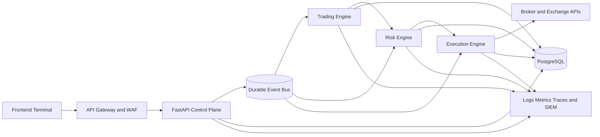
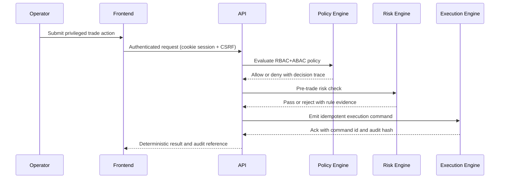

# Vision-AI Institutional Transformation Master Plan (2026-03-27)

## Mandate

Transform Vision-AI into an institutional-grade platform for real-money trading with deterministic safety controls, robust strategy depth, and auditable operations.

This document is execution-focused. It defines exact implementation tracks, code touchpoints, validation gates, and stop/go criteria.

## Baseline Reality (Brutally Realistic)

Current posture is materially improved but not at institutional completion.

| Domain                    | Current Score | Target Score | Gap Summary                                                                                                    |
| ------------------------- | ------------- | ------------ | -------------------------------------------------------------------------------------------------------------- |
| Strategy Completion       | 5.5/10        | 10/10        | Core quant/technical/risk exists; full fundamental/valuation/earnings/dividend/moat/macro engines not complete |
| Backend Architecture      | 7.5/10        | 10/10        | Strong hardening and microservice direction; durable eventing and policy control plane still incomplete        |
| Frontend Institutional UX | 7.0/10        | 10/10        | Good dashboard baseline; institutional terminal workflows and stress-tested realtime UX still incomplete       |
| Security                  | 8.6/10        | 10/10        | CSRF, revocation, hardening implemented; zero-trust mesh, formal ABAC, key governance maturity pending         |
| Deployment & DevOps       | 7.2/10        | 10/10        | Multi-target deploy config exists; full K8s autoscale, HA failover drills, release governance still pending    |
| Real-Money Readiness      | 62%           | 100%         | Simulation and controls present; full failure-injection, broker-grade execution safety evidence pending        |

## Phase 1: Strategy Completion (10/10 Target)

### 1.1 New Engines to Implement

1. Equity Screening Engine
2. DCF Valuation Engine
3. Earnings Intelligence Engine
4. Dividend Strategy Engine
5. Competitive Advantage Engine
6. Macro Regime Engine

### 1.2 Code-Level Implementation Map

1. Add fundamental engines package:
   - `backend/src/strategy/fundamental/`
   - `backend/src/strategy/fundamental/equity_screening.py`
   - `backend/src/strategy/fundamental/dcf_valuation.py`
   - `backend/src/strategy/fundamental/earnings_intelligence.py`
   - `backend/src/strategy/fundamental/dividend.py`
   - `backend/src/strategy/fundamental/competitive_advantage.py`
   - `backend/src/strategy/fundamental/macro_regime.py`
2. Add unified schema contracts:
   - `backend/src/contracts/strategy_signals.py`
3. Integrate into portfolio/risk signal bus:
   - `backend/src/services/signal_orchestrator.py`
   - `backend/src/portfolio/allocator.py`
   - `backend/src/risk/risk_engine.py`
4. Add data quality checks:
   - `backend/src/data/fundamental_data_quality.py`
5. Add tests:
   - `tests/test_equity_screening_engine.py`
   - `tests/test_dcf_engine.py`
   - `tests/test_earnings_engine.py`
   - `tests/test_dividend_engine.py`
   - `tests/test_moat_engine.py`
   - `tests/test_macro_engine.py`

### 1.3 Required Quant Upgrades

1. Quant engine robustness:
   - Purged walk-forward splits
   - Regime-balanced performance metrics
   - Survivorship bias controls
2. Technical engine multi-timeframe confirmation:
   - Trend confirmation on 4h/1h/15m
3. Risk engine institutional constraints:
   - VaR/CVaR caps
   - Max drawdown hard kill gates
   - Concentration and sector exposure caps
4. Portfolio engine optimization stack:
   - Kelly fraction with risk haircut
   - Hierarchical Risk Parity
   - Risk parity fallback mode

## Phase 2: Backend Hardening (10/10 Target)

### 2.1 Architecture and Eventing

1. Keep microservice split for API, trading, risk, execution.
2. Introduce durable event bus abstraction:
   - `backend/src/platform/events/bus.py` (interface)
   - `backend/src/platform/events/kafka_bus.py` (primary)
   - `backend/src/platform/events/redis_bus.py` (fallback)
3. Add idempotent command processing:
   - `backend/src/platform/execution/idempotency_store.py`
   - `backend/src/platform/execution/replay_guard.py`

### 2.2 Institutional Control Layer

1. OPA/Rego policy integration:
   - `backend/src/security/policy/pdp_client.py`
   - `backend/src/security/policy/rego/`
2. Dual approval workflow:
   - `backend/src/api/admin_dual_control_routes.py`
   - `backend/src/database/schema_dual_approval.sql`
3. Tamper-evident audit chain:
   - `backend/src/security/audit/audit_chain.py`

### 2.3 Reliability and Observability

1. Exactly-once/idempotency validation tests.
2. Retry and replay control tests under failure.
3. OpenTelemetry traces and alerting SLOs.

## Phase 3: Frontend Institutional Terminal (10/10 Target)

### 3.1 Product Surface

1. Institutional terminal layout:
   - Signals panel
   - Order blotter
   - Exposure and VaR panel
   - Execution health panel
2. Workflow-first actions:
   - Two-step confirmation for live-risk actions
   - Explicit risk acknowledgement dialogs

### 3.2 Code-Level Implementation Map

1. App shell and modules:
   - `frontend/src/app/terminal/page.tsx`
   - `frontend/src/components/terminal/`
2. State architecture hardening:
   - `frontend/src/store/terminalStore.ts`
   - `frontend/src/store/riskStore.ts`
3. Realtime transport resilience:
   - `frontend/src/services/websocket/streamManager.ts`
   - backoff+jitter, sequence gap detection, resubscribe strategy
4. Auth/security:
   - keep HttpOnly cookie session model
   - no browser token persistence

## Phase 4: Security Hardening (10/10 Target)

### 4.1 Control Requirements

1. Zero Trust implementation path:
   - service identity
   - mTLS between services
   - deny-by-default network policies
2. RBAC + ABAC matrix:
   - role grants plus attribute constraints (desk, region, risk tier)
3. Key management maturity:
   - KMS/Vault, rotation jobs, key use telemetry
4. Gateway and WAF:
   - centralized ingress protection and abuse signatures

### 4.2 Validation Gates

1. Security regression suite must pass 100%.
2. Privileged actions require MFA + policy + audit evidence.
3. No critical findings from SAST/SCA/secrets scan.

## Phase 5: Deployment and DevOps (10/10 Target)

### 5.1 Infrastructure

1. Kubernetes production manifests by service class.
2. HPA and pod disruption budgets for critical services.
3. Blue/green rollout and rollback automation.

### 5.2 CI/CD Security Gates

1. Mandatory policy checks before deploy.
2. Environment separation and protected promotions.
3. Provenance, SBOM, signed image requirements.

## Phase 6: Validation and Real-Money Readiness (100% Target)

### 6.1 Mandatory Test Program

1. Backtests with realistic fees/slippage/latency.
2. Walk-forward validation across regimes.
3. Monte Carlo shocks and drawdown stress.
4. Failure injection:
   - exchange API outage
   - stale market feed
   - event bus lag
   - partial DB outage
   - websocket disconnect storm

### 6.2 Hard Safety Requirements

1. Risk controls never bypassed under any simulated failure.
2. Kill switch trigger latency under defined threshold.
3. No unsafe execution path in chaos drills.

## Phase 7: Cleanup and Finalization

1. Remove generated artifacts and stale caches from workspace outputs.
2. Archive superseded audit documents to a dated archive directory.
3. Publish canonical architecture, runbook, and release guide.

## Phase 8: Ordered Execution Roadmap (Critical to Optional)

1. Critical now:
   - Strategy engines completion with contracts and tests
   - Event durability and idempotency controls
   - Dual approval + policy engine for privileged actions
   - Real-money safety validation suite
2. High priority:
   - Institutional terminal UX and risk workflow polish
   - Zero-trust runtime controls and key lifecycle automation
3. Optional after 10/10 baseline:
   - Additional asset-class strategy packs
   - advanced ML/RL experimentation in research sandboxes

## Architecture Diagrams

### Institutional Service Topology

### Control Enforcement Path

## Completion Criteria to Claim 10/10 and 100%

All of the following must be true:

1. All phase exit tests pass and are reproducible in CI and staging.
2. All privileged actions have policy, MFA, and tamper-evident audit chain.
3. Real-money safety drill pack passes with no control bypasses.
4. Independent review confirms no critical unresolved risks.

Until then, do not claim 100% real-money readiness.
